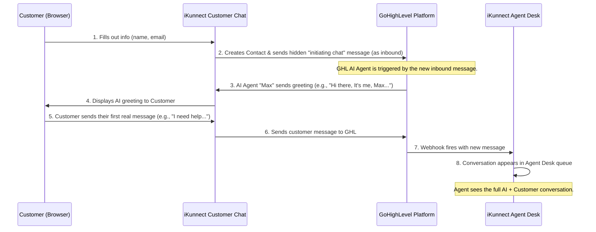

# iKunnect + GHL AI Agent - System Architecture

**Date:** November 15, 2025  
**Status:** ✅ Stable and Documented  
**Git Checkpoint:** `checkpoint-ai-agent-working`

---

## 1. Overview

This document outlines the current, simplified, and highly effective system architecture for the iKunnect and GoHighLevel (GHL) integration. The key change is the direct engagement of the **GHL AI Agent (Max)**, which has eliminated the need for a separate GHL workflow to handle greetings.

The system is now more intelligent, responsive, and robust.

---

## 2. System Components

The architecture consists of three main components:

1.  **iKunnect Customer Chat (`/customer-chat`):** A public-facing web application where customers initiate conversations.
2.  **GoHighLevel (GHL):** The core CRM and communication platform. Its primary roles are:
    *   Contact Management
    *   **AI-Powered Conversations (AI Agent "Max")**
    *   Webhook provider for real-time events.
3.  **iKunnect Agent Desk (`/`):** The internal dashboard where support agents manage and respond to customer conversations.

---

## 3. Message Flow (The New Model)

The process from chat initiation to agent response is now streamlined and AI-driven.

### Step-by-Step Breakdown:

1.  **Chat Initiation:** A customer visits the iKunnect Customer Chat page and submits their contact information.

2.  **Hidden Trigger Message:** The iKunnect backend immediately sends a hidden **inbound** message, `initiating chat`, to GHL on behalf of the customer. This is the crucial step that activates the GHL AI.

3.  **GHL AI Agent Engages:** GHL receives the `initiating chat` message. Because it's an inbound message on a new conversation, the configured **GHL AI Agent ("Max")** takes over and sends its initial greeting.

4.  **Customer Sees Greeting:** The AI's greeting is received by the iKunnect Customer Chat and displayed to the customer.

5.  **Customer Responds:** The customer replies to the AI's questions.

6.  **Webhook Notification:** All messages (from the AI and the customer) trigger the `InboundMessage` webhook in GHL, which sends the data to the iKunnect Agent Desk.

7.  **Agent Desk Updates:** The iKunnect Agent Desk receives the webhook payloads, stores the messages, and displays the full conversation in the agent's queue.

---

## 4. Why the GHL Workflow is Obsolete

The previous approach used a GHL Workflow to send a static greeting message. This is no longer needed.

-   **AI is Smarter:** The GHL AI Agent can do more than just send a greeting. It can ask qualifying questions, gather information, and even resolve issues without human intervention.
-   **Instant Response:** The AI responds immediately, providing a better customer experience than a delayed workflow action.
-   **Simplified Setup:** You no longer need to configure and maintain a separate GHL workflow for greetings. The entire process is handled by the GHL AI Agent settings.

**By disabling the workflow, you are simplifying the system and relying on the more powerful, built-in AI capabilities of GHL.**

---

## 5. Key Code Components & Logic

-   **Initial Trigger (`/api/chat/start/route.ts`):** This API route is responsible for sending the hidden `initiating chat` message. It now uses the `sendInboundMessage` function to ensure the message is correctly attributed to the customer.

-   **UI Filtering (`/components/chat/simple-messages.tsx` & `/app/customer-chat/page.tsx`):** The `initiating chat` message is explicitly filtered out of the message list so it is never visible in the UI.

-   **Agent Preview Filtering (`/api/chat/conversations/route.ts`):** The `lastMessageBody` field is checked, and if it is `initiating chat`, it is replaced with an empty string to keep the agent queue clean.

-   **Webhook (`/api/webhook/ghl/route.ts`):** The webhook allows the `initiating chat` message to be processed (so it can be stored) but does not filter it out like other system messages.

This architecture is stable, efficient, and leverages the best features of both iKunnect and GoHighLevel.
